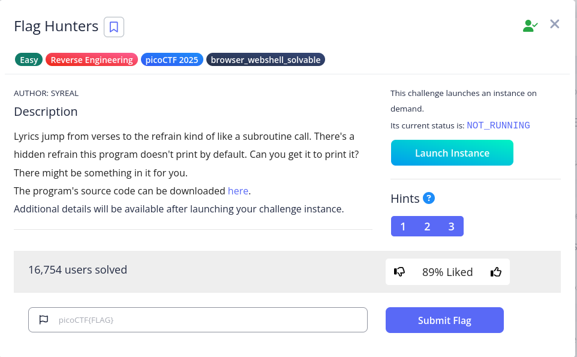

# Flag Hunters



We are given a file called `lyrics-reader.py`

Scanning the first part of the source code, we can see the following:

```jsx
# Read in flag from file
flag = open('flag.txt', 'r').read()

secret_intro = \
'''Pico warriors rising, puzzles laid bare,
Solving each challenge with precision and flair.
With unity and skill, flags we deliver,
The ether’s ours to conquer, '''\
+ flag + '\n'

song_flag_hunters = secret_intro +\
'''

[REFRAIN]
We’re flag hunters in the ether, lighting up the grid,
.
.
.
```

We know that `secret_intro` is the target

At the end of the code, we can see the logic behind the 

```jsx
  line_count = 0
  lip = start
  while not finished and line_count < MAX_LINES:
    line_count += 1
    for line in song_lines[lip].split(';'):
      if line == '' and song_lines[lip] != '':
        continue
      if line == 'REFRAIN':
        song_lines[refrain_return] = 'RETURN ' + str(lip + 1)
        lip = refrain
      elif re.match(r"CROWD.*", line):
        crowd = input('Crowd: ')
        song_lines[lip] = 'Crowd: ' + crowd
        lip += 1
      elif re.match(r"RETURN [0-9]+", line):
        lip = int(line.split()[1])
      elif line == 'END':
        finished = True
      else:
        print(line, flush=True)
        time.sleep(0.5)
        lip += 1
```

We can see keywords like `REFRAIN`, `END` across the lyrics above. What if we try to enter `END` directly?

The result? Failed. We can’t halt the program in this way

```jsx
We’re flag hunters in the ether, lighting up the grid,
No puzzle too dark, no challenge too hid.
With every exploit we trigger, every byte we decrypt,
We’re chasing that victory, and we’ll never quit.
Crowd: END

SQL injection, XSS flow,
Map the backend out, let the database show.
Inspecting each cookie, fiddler in the fight,
Capturing requests, push the payload just right.
HTML's secrets, backdoors unlocked,
In the world wide labyrinth, we’re never lost.

We’re flag hunters in the ether, lighting up the grid,
No puzzle too dark, no challenge too hid.
With every exploit we trigger, every byte we decrypt,
We’re chasing that victory, and we’ll never quit.
Crowd: END

Stack's overflowing, breaking the chain,
ROP gadget wizardry, ride it to fame.
Heap spray in silence, memory's plight,
Race the condition, crash it just right.
Shellcode ready, smashing the frame,
Control the instruction, flags call my name.

We’re flag hunters in the ether, lighting up the grid,
No puzzle too dark, no challenge too hid.
With every exploit we trigger, every byte we decrypt,
We’re chasing that victory, and we’ll never quit.
Crowd: END

```

After struggling a while, why don’t we try to add a `;` ahead of END?

```jsx
└─$ python lyric-reader.py
Command line wizards, we’re starting it right,
Spawning shells in the terminal, hacking all night.
Scripts and searches, grep through the void,
Every keystroke, we're a cypher's envoy.
Brute force the lock or craft that regex,
Flag on the horizon, what challenge is next?

We’re flag hunters in the ether, lighting up the grid,
No puzzle too dark, no challenge too hid.
With every exploit we trigger, every byte we decrypt,
We’re chasing that victory, and we’ll never quit.
Crowd: ;END 

Echoes in memory, packets in trace,
Digging through the remnants to uncover with haste.
Hex and headers, carving out clues,
Resurrect the hidden, it's forensics we choose.
Disk dumps and packet dumps, follow the trail,
Buried deep in the noise, but we will prevail.

We’re flag hunters in the ether, lighting up the grid,
No puzzle too dark, no challenge too hid.
With every exploit we trigger, every byte we decrypt,
We’re chasing that victory, and we’ll never quit.
Crowd: 
```

It Works! Because the `END` won’t be treated as a text. But how can we get the flag?

Recall that the `secret_intro` is first print, due to `song_flag_hunters = secret_intro +\...` . Yet, because of `reader(song_flag_hunters, '[VERSE1]')`, the program will start print from `Command line wizards, we’re starting it right,`

To get the intro, we can try to use `RETURN 0`, trying to return to the first line. 

We can try the payload `;RETURN 0`, and we can see the test flag in the middle

```jsx
Crowd: 
Pico warriors rising, puzzles laid bare,
Solving each challenge with precision and flair.
With unity and skill, flags we deliver,
The ether’s ours to conquer, flag{test}
```

Now we can connect to the instance and get flag:

```jsx
└─$ nc verbal-sleep.picoctf.net xxxxx
Command line wizards, we’re starting it right,
Spawning shells in the terminal, hacking all night.
Scripts and searches, grep through the void,
Every keystroke, we're a cypher's envoy.
Brute force the lock or craft that regex,
Flag on the horizon, what challenge is next?

We’re flag hunters in the ether, lighting up the grid,
No puzzle too dark, no challenge too hid.
With every exploit we trigger, every byte we decrypt,
We’re chasing that victory, and we’ll never quit.
Crowd: ;RETURN 0

Echoes in memory, packets in trace,
Digging through the remnants to uncover with haste.
Hex and headers, carving out clues,
Resurrect the hidden, it's forensics we choose.
Disk dumps and packet dumps, follow the trail,
Buried deep in the noise, but we will prevail.

We’re flag hunters in the ether, lighting up the grid,
No puzzle too dark, no challenge too hid.
With every exploit we trigger, every byte we decrypt,
We’re chasing that victory, and we’ll never quit.
Crowd: 
Pico warriors rising, puzzles laid bare,
Solving each challenge with precision and flair.
With unity and skill, flags we deliver,
The ether’s ours to conquer, picoCTF{70637h3r_f0r3v3r_836f0788}

[REFRAIN]
We’re flag hunters in the ether, lighting up the grid,
No puzzle too dark, no challenge too hid.
With every exploit we trigger, every byte we decrypt,
We’re chasing that victory, and we’ll never quit.
Crowd: 
Pico warriors rising, puzzles laid bare,
Solving each challenge with precision and flair.
With unity and skill, flags we deliver,
The ether’s ours to conquer, picoCTF{70637h3r_f0r3v3r_836f0788}

[REFRAIN]
We’re flag hunters in the ether, lighting up the grid,
No puzzle too dark, no challenge too hid.
With every exploit we trigger, every byte we decrypt,
We’re chasing that victory, and we’ll never quit.
Crowd: 
Pico warriors rising, puzzles laid bare,
Solving each challenge with precision and flair.
With unity and skill, flags we deliver,
The ether’s ours to conquer, picoCTF{70637h3r_f0r3v3r_836f0788}

[REFRAIN]
We’re flag hunters in the ether, lighting up the grid,
No puzzle too dark, no challenge too hid.
With every exploit we trigger, every byte we decrypt,
We’re chasing that victory, and we’ll never quit.
Crowd: 
Pico warriors rising, puzzles laid bare,
Solving each challenge with precision and flair.
With unity and skill, flags we deliver,
The ether’s ours to conquer, picoCTF{70637h3r_f0r3v3r_836f0788}

[REFRAIN]
We’re flag hunters in the ether, lighting up the grid,
No puzzle too dark, no challenge too hid.
With every exploit we trigger, every byte we decrypt,
We’re chasing that victory, and we’ll never quit.
Crowd: 
Pico warriors rising, puzzles laid bare,
Solving each challenge with precision and flair.
With unity and skill, flags we deliver,
The ether’s ours to conquer, picoCTF{70637h3r_f0r3v3r_836f0788}

[REFRAIN]
We’re flag hunters in the ether, lighting up the grid,
No puzzle too dark, no challenge too hid.
With every exploit we trigger, every byte we decrypt,
We’re chasing that victory, and we’ll never quit.
Crowd: 
Pico warriors rising, puzzles laid bare,
Solving each challenge with precision and flair.
With unity and skill, flags we deliver,
The ether’s ours to conquer, picoCTF{70637h3r_f0r3v3r_836f0788}

[REFRAIN]
We’re flag hunters in the ether, lighting up the grid,
No puzzle too dark, no challenge too hid.
With every exploit we trigger, every byte we decrypt,
We’re chasing that victory, and we’ll never quit.
Crowd: 
```

Flag: `picoCTF{70637h3r_f0r3v3r_836f0788}`
