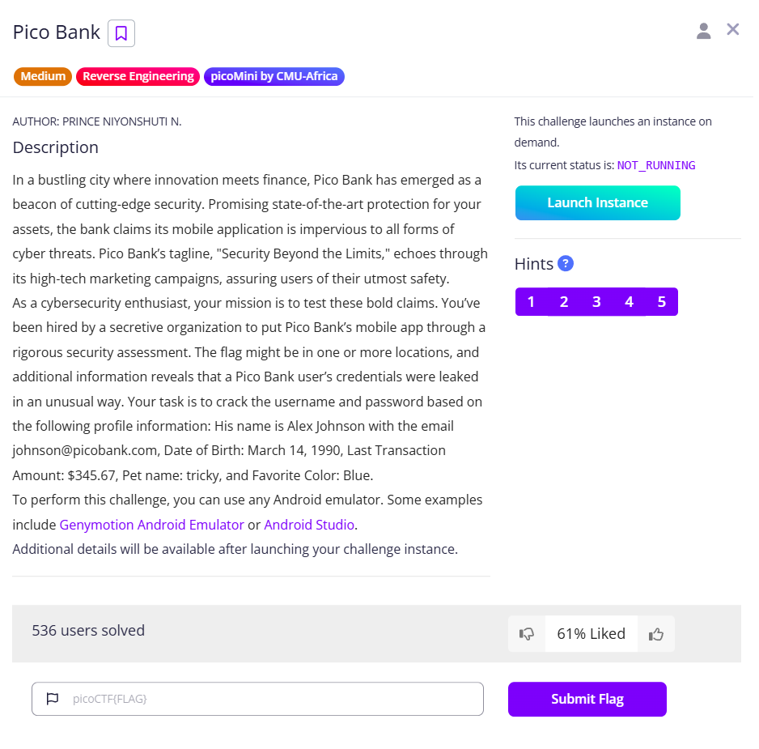

# Pico Bank



Once we open up the instance, we can click to download the app, which is an APK file, which is an Android package


We can use Android Emulators to open up the app, and we are asked to log in


To learn more about the APK file, we can try to use Jadx.


Then we can try to connect to the Android emulator using the IP address.

```bash
└─$ adb connect xxx.xxx.x.xx
Connected to xxx.xxx.x.xx:5555

└─$ adb devices
List of devices attached
xxx.xxx.x.xx:5555       device
```

<aside>
💡

You may need to enable Network Bridging Mode; the rest is similar to the steps shown in this video. In my case, I also need to enable root(under the ‘Other’ settings) so that I can view the data folder

[https://youtu.be/QlpDMmfOUmM?si=3xc9ysVwJw7wS5Hc](https://youtu.be/QlpDMmfOUmM?si=3xc9ysVwJw7wS5Hc)

</aside>

Then we can use `adb shell` to open up a shell. For me, I need to use `adb root` to ensure that ADB is running as root. 

But after some digging, I realize I can’t find anything useful.

So I opened up the APK in Jadx, and found that there was a Login function. Within it, we can see the login credential checking logic, with username = `johnson` and password = `tricky1990`


With the username and the password, we can go to the next stage: OTP


 Usually, an OTP requires the app to interact with the server, which then sends the OTP to the phone. However, we can see the endpoint is a placeholder, and it tries to compare the inputted OTP with `otp_value`


Search for `otp_value`, we can find that it is 9673


With that, we have entered the bank.


So after logging, we can try to get the flag. The notifications give us the direction of where to find the flag.


After that, I tried to intercept the app’s requests by using Burp Suite, and I found [this guide](https://passkwall.medium.com/how-to-configure-android-studio-with-burpsuite-46814392e31c) very useful, but in the end, after hours, I realized it won’t work.

So I go back and search through the `verifyOTP` function again, and we will see that there is an endpoint.


So we can send a POST request with the OTP, and we will get the second half of the flag

```python
curl -X POST http://amiable-citadel.picoctf.net:xxxxx/verify-otp -H "Content-Type: application/json" -d '{"otp":"9673"}'
{"success":true,"message":"OTP verified successfully","flag":"s3cur3d_m0b1l3_l0g1n_e9d3786f}","hint":"The other part of the flag is hidden in the app"}
```

But… where is the first half? 

If you are aware of the weird amounts in the transaction, this should be clear.


We can write a Python script to convert those binaries to ASCII characters

```bash
binary = [1110000,1101001,1100011,1101111,1000011,1010100,1000110,1111011,110001,1011111,1101100,110001,110011,1100100,1011111,110100,1100010,110000,1110101,1110100,1011111,1100010,110011,110001,1101110,1100111,1011111]
print(''.join(chr(int(str(char),2)) for char in binary))
```

Run the code, and we will get the first half.

```bash
└─$ python test.py 
picoCTF{1_l13d_4b0ut_b31ng_
```

Flag: `picoCTF{1_l13d_4b0ut_b31ng_s3cur3d_m0b1l3_l0g1n_e9d3786f}`
