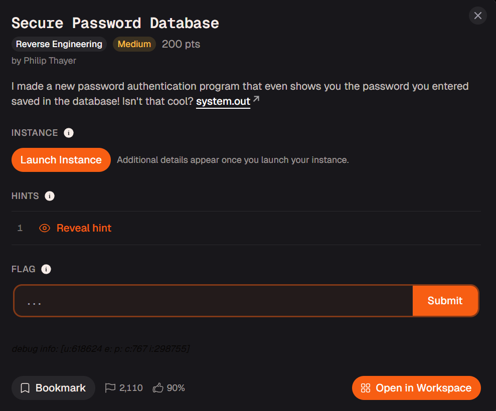

# Secure Password Database



## Execute the Code

We can first try to run the code; it will prompt us to set a password, its length, and the hash needed to access the account.

```bash
└─$ ./system.out
Please set a password for your account:
test
How many bytes in length is your password?
4
You entered: 4
Your successfully stored password:
116 101 115 116 10 
Enter your hash to access your account!
ew
system.out: heartbleed.c:69: main: Assertion `1 == 0' failed.
Aborted                    ./system.out
```

## Code Analysis

To understand what happens in the code, we need a decompiler to make sense of it. I used Ghidra, and after some renaming, here is the main function.

```c
undefined8 main(void)

{
  uint input_int;
  char *pcVar1;
  undefined8 uVar2;
  long in_FS_OFFSET;
  int j;
  char *local_120;
  ulong i;
  char *buffer;
  size_t input_buffer_2_length;
  ulong local_100;
  ulong secret;
  FILE *local_f0;
  undefined1 local_e5 [13];
  char input_buffer [31];
  char input_buffer_2 [65];
  char local_78 [104];
  long canary;
  
  canary = *(long *)(in_FS_OFFSET + 0x28);
  buffer = calloc(0x5a,1);
  for (i = 0; i < 0xd; i = i + 1) {
    buffer[i + 0x3c] = obf_bytes[i] ^ 0xaa;
  }
  puts("Please set a password for your account:");
  pcVar1 = fgets(input_buffer_2 + 1,0x32,stdin);
  if (pcVar1 != (char *)0x0) {
    strcpy(buffer,input_buffer_2 + 1);
    puts("How many bytes in length is your password?");
    pcVar1 = fgets(input_buffer,0x14,stdin);
    if (pcVar1 != (char *)0x0) {
      input_int = atoi(input_buffer);
      printf("You entered: %d\n",(ulong)input_int);
      puts("Your successfully stored password:");
      for (j = 0; (j <= (int)input_int && (j < 0x5a)); j = j + 1) {
        printf("%d ",(ulong)(uint)(int)buffer[j]);
      }
      putchar(10);
    }
  }
  puts("Enter your hash to access your account!");
  pcVar1 = fgets(input_buffer_2 + 1,0x32,stdin);
  if (pcVar1 != (char *)0x0) {
    input_buffer_2_length = strlen(input_buffer_2 + 1);
    if ((input_buffer_2_length != 0) && (input_buffer_2[input_buffer_2_length] == '\n')) {
      input_buffer_2[input_buffer_2_length] = '\0';
    }
    local_100 = strtoul(input_buffer_2 + 1,&local_120,10);
    if (local_120 == input_buffer_2 + 1) {
      printf("No digits were found");
                    /* WARNING: Subroutine does not return */
      __assert_fail("1 == 0","heartbleed.c",0x45,"main");
    }
    secret = make_secret(local_e5);
    if (secret == local_100) {
      local_f0 = fopen("flag.txt","r");
      if (local_f0 == (FILE *)0x0) {
        perror("Could not open flag.txt");
        uVar2 = 1;
        goto LAB_0010173e;
      }
      pcVar1 = fgets(local_78,100,local_f0);
      if (pcVar1 == (char *)0x0) {
        puts("Failed to read the flag");
      }
      else {
        printf("%s",local_78);
      }
      fclose(local_f0);
    }
  }
  free(buffer);
  uVar2 = 0;
LAB_0010173e:
  if (canary != *(long *)(in_FS_OFFSET + 0x28)) {
                    /* WARNING: Subroutine does not return */
    __stack_chk_fail();
  }
  return uVar2;
}

```

### Obfuscated Bytes Leaked

At the beginning, we can see that a buffer is allocated using `calloc`.

```c
buffer = calloc(0x5a,1);
 for (i = 0; i < 0xd; i = i + 1) {
   buffer[i + 0x3c] = obf_bytes[i] ^ 0xaa;
```

Inside the buffer, the `obf_bytes` (obfuscated bytes) are XORed with `0xaa`.

```bash
C3h FFh C8h C2h 92h 9Bh 8Bh C0h 80h C2h C4h 8Bh
```

### User-provided Length

We then see the prompts we saw earlier.

```c
puts("Please set a password for your account:");
pcVar1 = fgets(input_buffer_2 + 1,0x32,stdin);
if (pcVar1 != (char *)0x0) {
  strcpy(buffer,input_buffer_2 + 1);
  puts("How many bytes in length is your password?");
  pcVar1 = fgets(input_buffer,0x14,stdin);
  if (pcVar1 != (char *)0x0) {
    input_int = atoi(input_buffer);
    printf("You entered: %d\n",(ulong)input_int);
    puts("Your successfully stored password:");
    for (j = 0; (j <= (int)input_int && (j < 0x5a)); j = j + 1) {
      printf("%d ",(ulong)(uint)(int)buffer[j]);
    }
    putchar(10);
  }
}
```

Because the program allows us to enter the length of the password and trust it fully, we can even see the XORed values in the buffer:

```bash
└─$ ./system.out                                                                                                                                                                                                                            
Please set a password for your account:
test
How many bytes in length is your password?
71
You entered: 71
Your successfully stored password:
116 101 115 116 10 0 0 0 0 0 0 0 0 0 0 0 0 0 0 0 0 0 0 0 0 0 0 0 0 0 0 0 0 0 0 0 0 0 0 0 0 0 0 0 0 0 0 0 0 0 0 0 0 0 0 0 0 0 0 0 105 85 98 104 56 49 33 106 42 104 110 33 
Enter your hash to access your account!
```

The deobfuscated bytes are the following:

```bash
105 85 98 104 56 49 33 106 42 104 110 33
```

### Weak Hash Function

Keep reading the main function, and we learn how the hash is formed

```c
secret = make_secret(local_e5);
if (secret == local_100) {
  local_f0 = fopen("flag.txt","r");
  if (local_f0 == (FILE *)0x0) {
    perror("Could not open flag.txt");
    uVar2 = 1;
    goto LAB_0010173e;
  }
  pcVar1 = fgets(local_78,100,local_f0);
  if (pcVar1 == (char *)0x0) {
    puts("Failed to read the flag");
  }
  else {
    printf("%s",local_78);
  }
  fclose(local_f0);
}
```

It seems it involves the `make_secret` function. We can take a brief look

```c
void make_secret(long param_1)

{
  long i;
  
  for (i = 0; obf_bytes[i] != '\0'; i = i + 1) {
    *(byte *)(i + param_1) = obf_bytes[i] ^ 0xaa;
  }
  *(undefined1 *)(param_1 + 0xc) = 0;
  hash(param_1);
  return;
}
```

It simply XORs the values again, stores them in `local_e5`, and then calls the `hash` function with them.

We can then take a look the hash function.

```c
long hash(byte *param_1)

{
  byte *char;
  long seed;
  
  seed = 0x1505;
  char = param_1;
  while( true ) {
    if (*char == 0) break;
    seed = (long)(int)(uint)*char + seed * 0x21;
    char = char + 1;
  }
  return seed;
}
```

It reveals the seed, and all it does is a simple calculation.

## Script

With the above analysis, we can write the script to get the flag.

```python
from pwn import *

def start(argv=[], *a, **kwargs):
    if args.GDB:
        return gdb.debug([exe]+argv, gdbscript=gdbscript , *a, **kwargs)
    elif args.REMOTE:
        return remote(sys.argv[1], sys.argv[2], *a, **kwargs)
    else:
       return process([exe]+argv, *a, **kwargs)

gdbscript = """
continue
"""

exe="./system.out"
elf=context.binary=ELF(exe)
context.log_level="debug"

io = start()

io.sendlineafter(b'Please set a password for your account:', b'0')
io.sendlineafter(b'How many bytes in length is your password?', b'71')
io.recvline()
io.recvline()
io.recvline()

leaked=io.recvline().decode().strip().split(" ")[60::]
log.info(f"{leaked}")

seed=0x1505

for byte in leaked:
    seed = seed * 0x21 + (int(byte)) & 0xFFFFFFFFFFFFFFFF

hash = seed

log.info(f"{hash}")

io.sendlineafter(b"Enter your hash to access your account!", str(hash).encode())

io.interactive()
```

## Solve

Run the script to get the flag

```bash
─$ python test.py REMOTE candy-mountain.picoctf.net xxxxx                                                                                                                                                                                 
...
[DEBUG] Received 0x29 bytes:
    b'Please set a password for your account:\r\n'
[DEBUG] Sent 0x2 bytes:
    b'0\n'
[DEBUG] Received 0x2c bytes:
    b'How many bytes in length is your password?\r\n'
[DEBUG] Sent 0x3 bytes:
    b'71\n'
[DEBUG] Received 0x103 bytes:
    b'You entered: 71\r\n'
    b'Your successfully stored password:\r\n'
    b'48 10 0 0 0 0 0 0 0 0 0 0 0 0 0 0 0 0 0 0 0 0 0 0 0 0 0 0 0 0 0 0 0 0 0 0 0 0 0 0 0 0 0 0 0 0 0 0 0 0 0 0 0 0 0 0 0 0 0 0 105 85 98 104 56 49 33 106 42 104 110 33 \r\n'
    b'Enter your hash to access your account!\r\n'
[*] ['105', '85', '98', '104', '56', '49', '33', '106', '42', '104', '110', '33']
[*] 15237662580160011234
[DEBUG] Sent 0x15 bytes:
    b'15237662580160011234\n'
[*] Switching to interactive mode

[DEBUG] Received 0x1b bytes:
    b'picoCTF{d0nt_trust_us3rs}\r\n'
picoCTF{d0nt_trust_us3rs}
[*] Got EOF while reading in interactive
```

Flag: `picoCTF{d0nt_trust_us3rs}`
