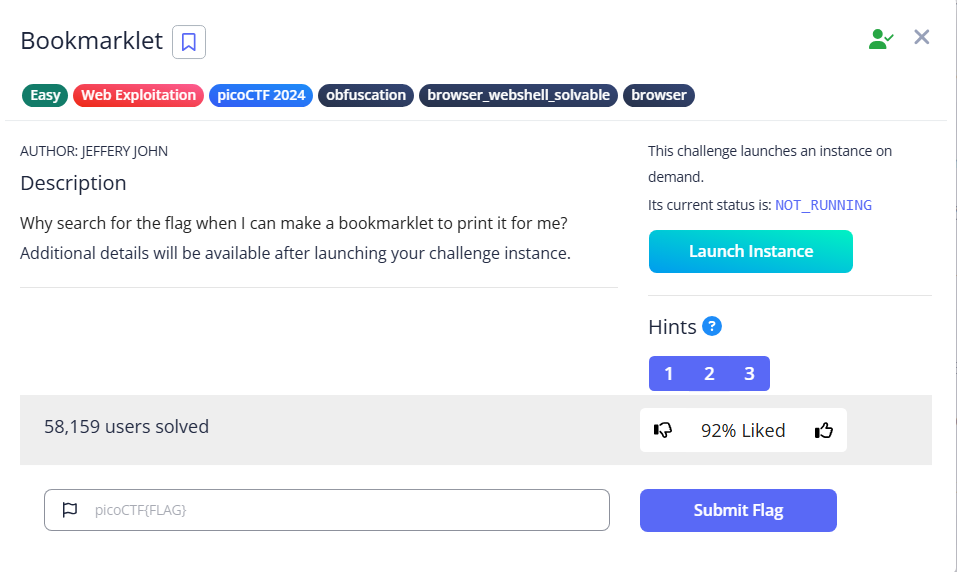

# Bookmarklet



Upon reaching the site, we can see there is a piece of code. If we search the title ‘Bookmarket’, we can see that a [bookmarlet](https://en.wikipedia.org/wiki/Bookmarklet) is just a piece of JavaScript code within an webpage


Here is the function. We can see that the ciphertext is encrypted using the key `picoctf`

```javascript
javascript:(function() {
            var encryptedFlag = "àÒÆަȬëÙ£Ö�ÓÚåÛÑ¢ÕÓ˨Ë�Ó�§Èí";
            var key = "picoctf";
            var decryptedFlag = "";
            for (var i = 0; i < encryptedFlag.length; i++) {
                decryptedFlag += String.fromCharCode((encryptedFlag.charCodeAt(i) - key.charCodeAt(i % key.length) + 256) % 256);
            }
            alert(decryptedFlag);
        })();
```

To solve this, we can simply paste the code in the console after opening the web inspector


The alert function will alert the flag


Flag: `picoCTF{p@g3_turn3r_e8b2d43b}`
