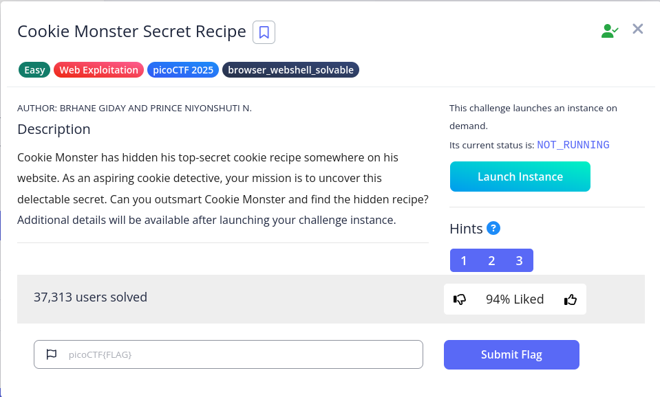

# Cookie Monster Secret Recipe

It seems that we need to log in. Let try `test:test`

Access Denied

However, if we press F-12 and navigate to Application, we can see a strange cookie

Base 64 decode `cGljb0NURntjMDBrMWVfbTBuc3Rlcl9sMHZlc19jMDBraWVzXzQ3MzZGNkNCfQ%3D%3D` and obtain the flag

Flag: `picoCTF{c00k1e_m0nster_l0ves_c00kies_4736F6CB}`
