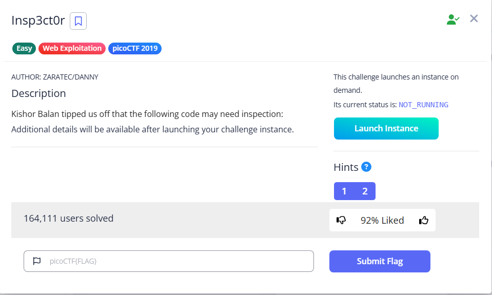

# Insp3ct0r



Here is the challenge website


Upon inspection, we will find the first part of the flag

`<!-- Html is neat. Anyways have 1/3 of the flag: picoCTF{tru3_d3 -->`

As the website suggests, we should also inspect CSS and JS, which are revealed in the main page

```html
    <link rel="stylesheet" type="text/css" href="mycss.css">
    <script type="application/javascript" src="myjs.js"></script>
```

In mycss.css, we get the second part of the flag
`/* You need CSS to make pretty pages. Here's part 2/3 of the flag: t3ct1ve_0r_ju5t */`
In myjs.js, we gather the last part
`/* Javascript sure is neat. Anyways part 3/3 of the flag: _lucky?302945a7} */`

Flag: `picoCTF{tru3_d3t3ct1ve_0r_ju5t_lucky?302945a7}`
