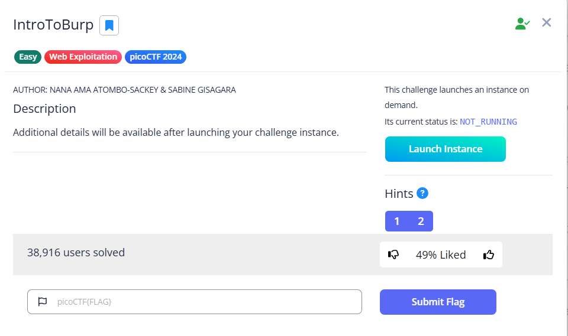

# IntroToBurp

Within the web instance, there is an HTML registration form that we can fill out. Here I type everything as ‘test’

However, after that, we have no idea how to fill in the OTP

If we try to submit ‘test’, it will return ‘**Invalid OTP**’

To solve this challenge, we need to use a tool called Burp Suite. It is a tool capable of capturing web requests and manipulating them.

We can start a new project, and here is the main page

Go to the proxy tab first, then open the browser

A chromium page should show up, and access the web instance in that page, then go back to Burp Suite to open up the intercept, this will intercept the requests and responses. 

After filling the form, we can click submit, and we can see Burp Suite capture a request, click the Forward button to send the request

Keep forwarding until we reach the 2FA authentication again

If we submit the ‘test’ OTP, we can see the request will look like this

What if we remove the entire line `otp=test`, and send the request?

<aside>
💡

I did need a few attempts to get the flag, so try few more times if you are doing the same but failed

</aside>

Turns out that if you don’t include the OTP, you can bypass it successfully

Flag: `picoCTF{#0TP_Bypvss_SuCc3$S_2e80f1fd}`
