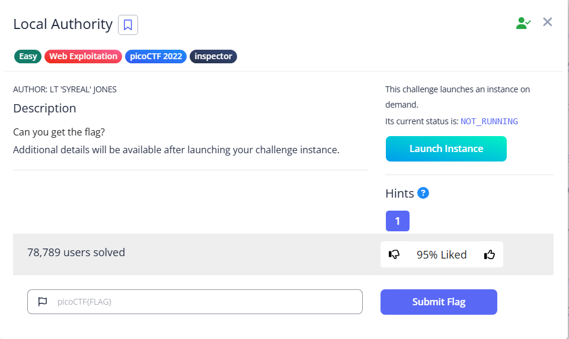

# Local Authority



We will see a login form appears before us when we arrive the instance


If we inspect the HTML, we will see that there is a `login.php` that is responsible for handling our login

```html
<!DOCTYPE html>
<html lang="en">
  <head>
    <meta charset="UTF-8">
    <meta name="viewport" content="width=device-width, initial-scale=1.0">
    <meta http-equiv="X-UA-Compatible" content="ie=edge">
    <link rel="stylesheet" href="style.css">
    <title>Secure Customer Portal</title>
  </head>
  <body>

    <h1>Secure Customer Portal</h1>
    
   <p>Only letters and numbers allowed for username and password.</p>
    
    <form role="form" action="login.php" method="post">
      <input type="text" name="username" placeholder="Username" required 
       autofocus></br>
      <input type="password" name="password" placeholder="Password" required>
      <button type="submit" name="login">Login</button>
    </form>
  </body>
</html>
```

We can see a usage of the `checkPassword` function, but where is the declaration? It is actually at the script tag


Opening it up, we will find the credentials for us to login

```html
function checkPassword(username, password)
{
  if( username === 'admin' && password === 'strongPassword098765' )
  {
    return true;
  }
  else
  {
    return false;
  }
}
```

credentials: `admin:strongPassword098765`

Entering them will give us the flag


Flag: `picoCTF{j5_15_7r4n5p4r3n7_05df90c8}`
