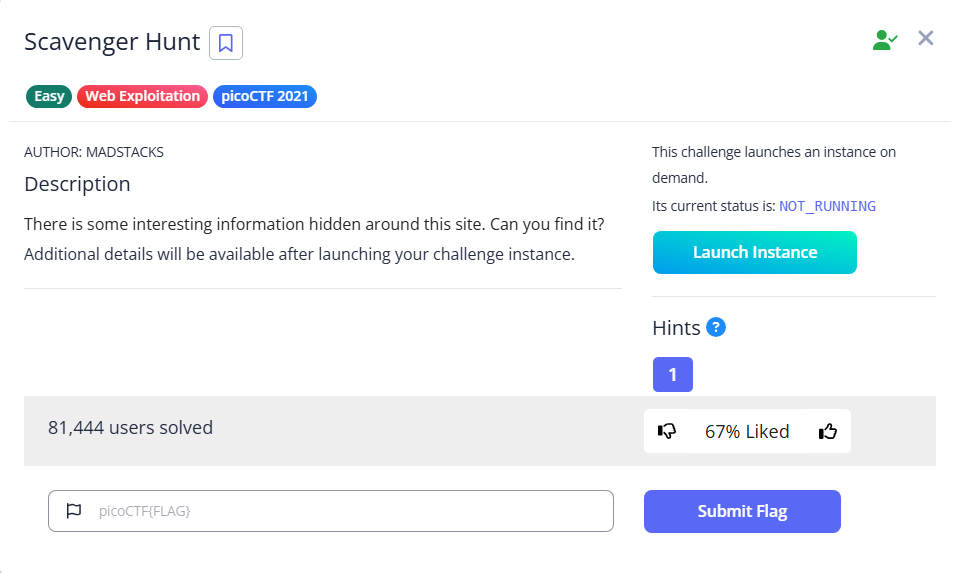

# Scavenger Hunt



Using F-12 to view the source of the home page, we can find the first part of the flag `picoCTF{t`

```html
<div id="tababout" class="tabcontent">
		<h3>What</h3>
		<p>I used these to make this site: <br/>
		  HTML <br/>
		  CSS <br/>
		  JS (JavaScript)
		</p>
	<!-- Here's the first part of the flag: picoCTF{t -->
      </div>
```

In `mycss.css`, we can find the second part of the flag `h4ts_4_l0`

```css
#tabintro { background-color: #ccc; }
#tababout { background-color: #ccc; }

/* CSS makes the page look nice, and yes, it also has part of the flag. Here's part 2: h4ts_4_l0 */
```

In `myjs.js`, we find the following hints

```jsx
/* How can I keep Google from indexing my website? */
```

It should be referring to robots.txt. According to [Wikipedia](https://en.wikipedia.org/wiki/Robots.txt):

> robots.txt is the filename used for implementing the Robots Exclusion Protocol, a standard used by websites to indicate to visiting web crawlers and other web robots which portions of the website they are allowed to visit.
> 

When we visit it, we can see the third part `t_0f_pl4c`

```html
User-agent: *
Disallow: /index.html
# Part 3: t_0f_pl4c
# I think this is an apache server... can you Access the next flag?
```

We can try some common files in [Apache](https://httpd.apache.org/docs/2.4/configuring.html). And I find `.htaccess`, we get the fourth part `3s_2_lO0k`

```html
# Part 4: 3s_2_lO0k
# I love making websites on my Mac, I can Store a lot of information there.
```

 I immediately think of `.DS_Store`. According to [Wikipedia](https://en.wikipedia.org/wiki/.DS_Store)

> .DS_Store is a file generated by macOS that stores custom attributes of its containing folder, such as folder view options, icon positions, and other visual information.[1] The name is an abbreviation of Desktop Services Store,[2] reflecting its purpose.
> 

Accessing it, and we get the final part `_9588550}`

```html
Congrats! You've completed the scavenger hunt! Part 5: _9588550}
```

Flag: `picoCTF{th4ts_4_l0t_0f_pl4c3s_2_lO0k_9588550}`
