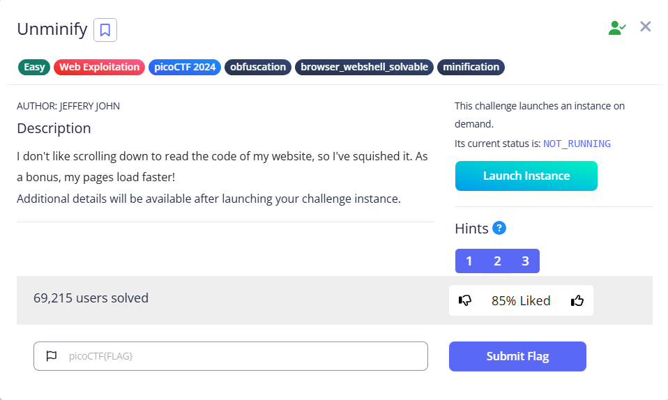

# Unminify

Here is the website

We can use `Ctrl-U` to view the source code, then `Ctrl-F` to search the flag

Using Curl to get the content, then Grep the flag is also an option

`curl http://titan.picoctf.net:xxxxx|grep 'picoCTF{'`

Flag: `picoCTF{pr3tty_c0d3_d9c45a0b}`
