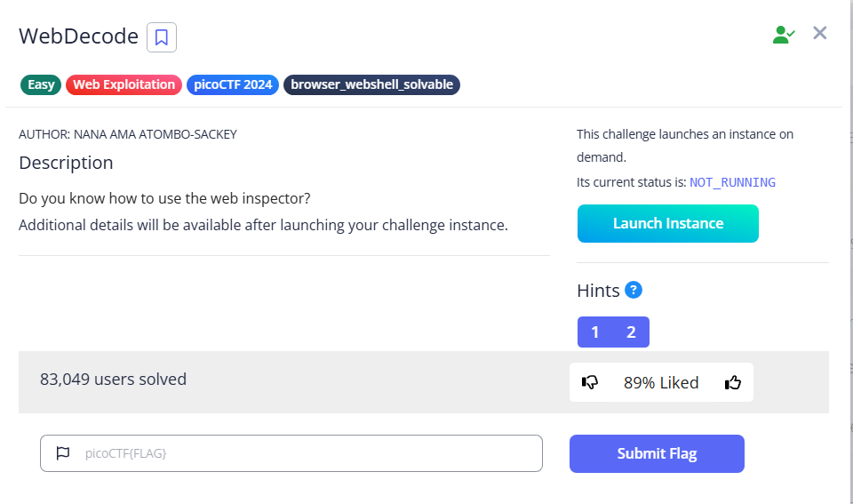

# WebDecode



There are only three pages available

### Home


### About


### Contact


At first glance, it might seem that the flag is nowhere, but in the about page, we can see ‘Try inspecting the page!!’, with the description having ‘web inspector', we can try to press `F12`  or `ctrl-U`

In one of the lines, we can see a base-64 string

```html
<section class="about" notify_true="cGljb0NURnt3ZWJfc3VjYzNzc2Z1bGx5X2QzYzBkZWRfMDdiOTFjNzl9">
```

So all we need to do is just base64 decode

```bash
└─$ base64 -d <<< cGljb0NURnt3ZWJfc3VjYzNzc2Z1bGx5X2QzYzBkZWRfMDdiOTFjNzl9
picoCTF{web_succ3ssfully_d3c0ded_07b91c79}
```

Flag: `picoCTF{web_succ3ssfully_d3c0ded_07b91c79}`
