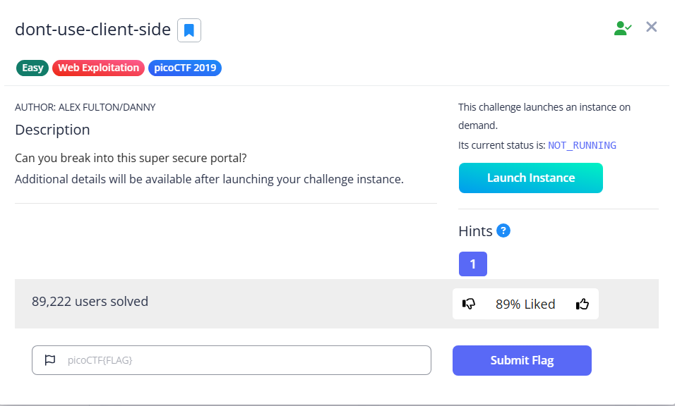

# dont-use-client-side



Once we launch the instance, we will see a login page


We can view the source and see how it verify the credentials

```html
<html>
<head>
<title>Secure Login Portal</title>
</head>
<body bgcolor=blue>
<!-- standard MD5 implementation -->
<script type="text/javascript" src="md5.js"></script>

<script type="text/javascript">
  function verify() {
    checkpass = document.getElementById("pass").value;
    split = 4;
    if (checkpass.substring(0, split) == 'pico') {
      if (checkpass.substring(split*6, split*7) == 'eb02') {
        if (checkpass.substring(split, split*2) == 'CTF{') {
         if (checkpass.substring(split*4, split*5) == 'ts_p') {
          if (checkpass.substring(split*3, split*4) == 'lien') {
            if (checkpass.substring(split*5, split*6) == 'lz_2') {
              if (checkpass.substring(split*2, split*3) == 'no_c') {
                if (checkpass.substring(split*7, split*8) == 'b45}') {
                  alert("Password Verified")
                  }
                }
              }
      
            }
          }
        }
      }
    }
    else {
      alert("Incorrect password");
    }
    
  }
</script>
<div style="position:relative; padding:5px;top:50px; left:38%; width:350px; height:140px; background-color:yellow">
<div style="text-align:center">
<p>This is the secure login portal</p>
<p>Enter valid credentials to proceed</p>
<form action="index.html" method="post">
<input type="password" id="pass" size="8" />
<br/>
<input type="submit" value="verify" onclick="verify(); return false;" />
</form>
</div>
</div>
</body>
</html>
```

The web uses the `substring` function to split the flag into 4-character chunks and verifies them one by one. To recover the flag, simply follow the check logic from start to finish.

After recovering the flag, we can submit the flag for verification 


Flag: `picoCTF{no_clients_plz_2eb02b45}`
