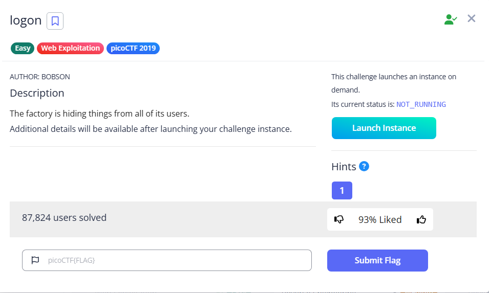

# logon

This is a quirky login site. You can login even without a credential

And we can’t see the flag

Turns out there is an admin cookie which is set to False. We can change it to True

And we get the flag

Flag: `picoCTF{th3_c0nsp1r4cy_l1v3s_4d184b0d}`
