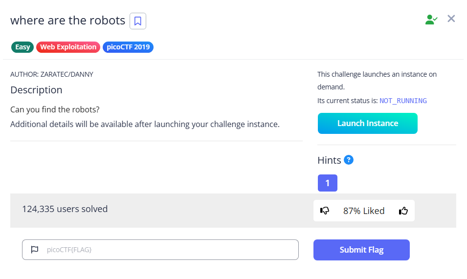

# where are the robots



Going to robots.txt, as hinted in the title, we can see that an HTML page is disallowed

```html
User-agent: *
Disallow: /cc6b1.html
```

Going to that page will gives us the flag


Flag: `picoCTF{ca1cu1at1ng_Mach1n3s_cc6b1}`
