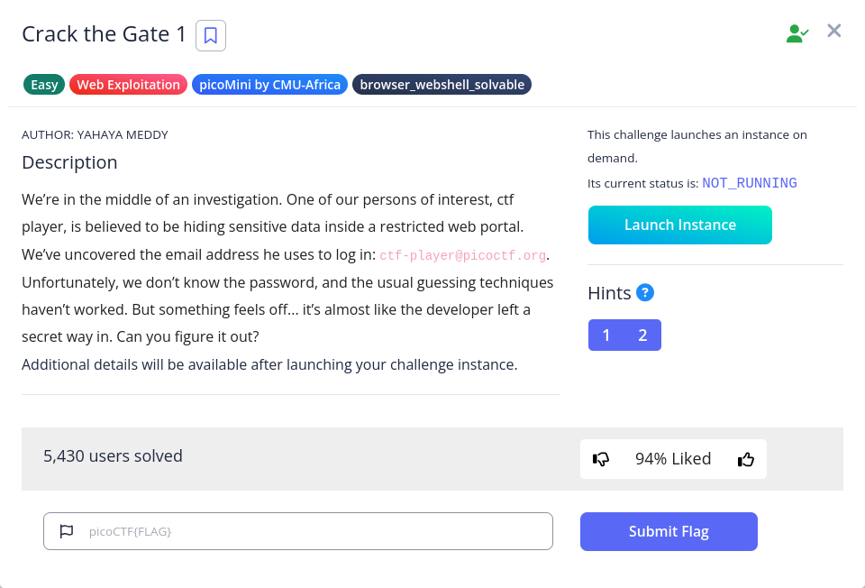

# Crack the Gate 1



Launching the instance, we can see a login panel like this:


Press Ctrl-U to view the source code, we can see a comment:


It is probably a monoalphabetic substitution, which I guess it is ROT-13. We can convert it in bash using tr https://stackoverflow.com/questions/5442436/using-rot13-and-tr-command-for-having-an-encrypted-email-address

```bash
└─$ echo '<!-- ABGR: Wnpx - grzcbenel olcnff: hfr urnqre "K-Qri-Npprff: lrf" -->'|tr 'A-Za-z' 'N-ZA-Mn-za-m'
<!-- NOTE: Jack - temporary bypass: use header "X-Dev-Access: yes" -->
```

I intercept the request using Caido, add the header to send to request. Then a pop-up window appears and show me the flag:


This is the response intercepted by Caido


Flag: `picoCTF{brut4_f0rc4_0d39383f}`
