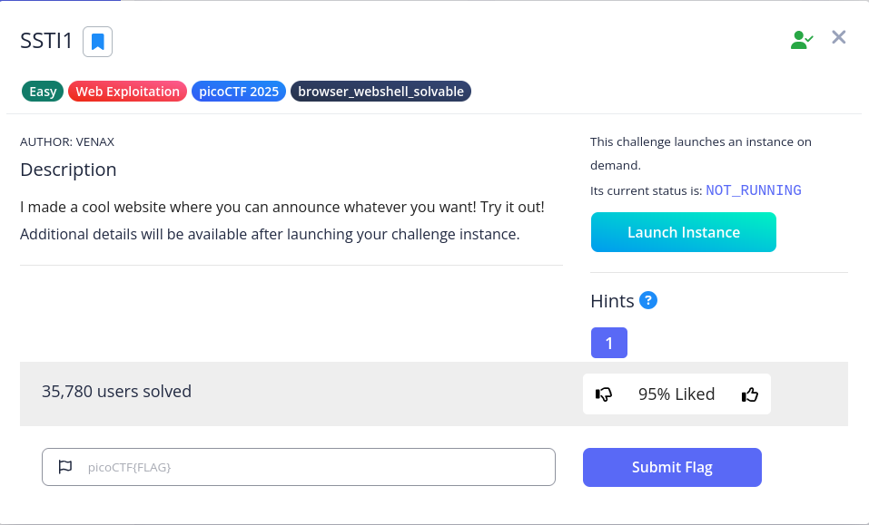

# SSTI 1



After we launch the instance, we can see that there is a text box for us to exploit


It is hinted by the title of this challenge SSTI, that this challenge is related to Server Side Template Injection(SSTI), which we use the template used by the server to exploit. For instance, we can try to enter the following command: `{{7*7}}`, it will result in 49


You might find that the result 49 is meaningless, but it actually expose the template the server is using, Jinja. You can refer to this article: https://www.stackhawk.com/blog/finding-and-fixing-ssti-vulnerabilities-in-flask-python-with-stackhawk/

To find the flag, we first need to know how to list the files. We can follow this video:

https://youtu.be/SN6EVIG4c-0?si=3bs7L4DR7LeJCvqi

You can also refer this as reference:

https://grok.com/share/bGVnYWN5_c88964a2-db02-4089-a5b3-fe8019298f5c

However I still can’t solve it. I also tried to search for payloads in the Internet, but failed. I tired one more prompt and this successfully show the contents

```bash
{{request.application.__globals__.__builtins__.__import__('os').popen('ls -R').read()}}
```


To get flag, we can replace the ls to cat flag


After reading this writeup https://medium.com/@pragusga/picoctf-write-up-ssti1-server-side-template-injection-38702986091d, I realize we can use `{{ self.__init__.__globals__.__builtins__ }}` to check the functions


We can then use `{{ self.__init__.__globals__.__builtins__.__import('os').popen('ls').read() }}`

to import the os modules and use popen(use pipe to invoke shell)https://docs.python.org/3/library/subprocess.html#using-the-subprocess-module

Flag: **`picoCTF{s4rv3r_s1d3_t3mp14t3_1nj3ct10n5_4r3_c001_9451989d}`**
